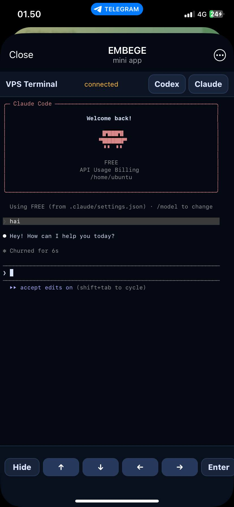

# Telegram VPS Monitor Mini App

**VPS ni kuzating, favqulodda terminal oching va Claude Code ishlatib — bularning barchasini Telegram dan.**

Yengil, o'z serveringizda ishlaydigan Telegram Mini App. Glassmorphism dizayn, mobil qurilmaga mo'ljallangan, Flask + vanilla JS — build qadami yo'q, framework bog'liqligi yo'q.

> Eng yaxshi foydalanish holati: **favqulodda kirish + kichik vazifalar**. Uzoq va og'ir terminal ishlari uchun SSH/desktop terminal hali ham yaxshiroq.

<p align="center">
    
    
    
</p>

---

## Yangiliklar (v2026-05)

- **Qayta ishlangan UI** — aurora gradient fon, glassmorphism panellar, metrikalar uchun gradient matn, animatsiyali status, skeleton yuklash
- **Terminal autentifikatsiya tuzatildi** — bosh sahifadagi terminal tugmalari endi Telegram `initData` ni `?tg=` parametri orqali to'g'ri uzatadi
- **Dashboard da terminal tugmalari** — bosh ko'rinishdan chiqmay Terminal yoki Claude Code ochish
- **Yaxshilangan mobil tipografiya** — tabular-nums, sozlangan harf oraliqlari, 380px nuqtasi
- **Ko'rinadigan holat indikatorlari** — status nishonlarida animatsiyali nuqta, birinchi metrikalar kelgunga qadar skeleton

---

## Nima uchun yaratilgan

Ba'zida faqat telefon qo'lingizda bo'ladi. Siz:

- VPS tirikmi yoki yo'qmi tekshirishingiz kerak
- CPU/RAM/disk/load ni ko'rishingiz kerak
- Servisni qayta ishga tushirishingiz yoki tekshirishingiz kerak
- Tez shell buyrug'i bajarishingiz kerak
- **Claude Code** ga biror narsani tuzattirishingiz kerak
- Noutbukka yetib borguncha shoshilinch muammoni hal qilishingiz kerak

Bu ilova barcha ushbu ishni bitta Telegram Mini App tugmasi orqasiga joylashtiradi.

---

## Asosiy xususiyatlar

- **Mobil dashboard** — CPU (ring + gradient matn), RAM, disk, load, uptime, servislar, top jarayonlar
- **Telegram Mini App** — Telegram ichidagi `VPS` tugmasidan ochiladi
- **Telegram dan Claude Code** — tezkor kod tuzatish, ko'rib chiqish, kichik tahrirlash
- **Web terminal** — xterm.js bilan ishlaydi, mobil klaviatura yordamchilari bilan
- **Telegram autentifikatsiya** — `initData` HMAC tekshiruvi + foydalanuvchi ID ro'yxati
- **Yengil** — Flask + vanilla JS, build qadami yo'q
- **Oddiy joylashtirish** — gunicorn + systemd + HTTPS domen

---

## Texnologiyalar

- Python 3.10+ Flask
- Flask-Sock (WebSocket terminal)
- Gunicorn (ishlab chiqarish)
- Vanilla HTML/CSS/JS, xterm.js (`static/vendor/` da)
- Glassmorphism CSS + SVG gradientlar

---

## Marshrutlar

| Marshrut | Tavsif |
|---|---|
| `/` | Glassmorphism dashboard (CPU/RAM/disk/servislar/jarayonlar) |
| `/terminal` | PTY shell terminali (xterm.js) |
| `/claude` | `claude` CLI ni avtomatik ishga tushuradigan terminal |
| `/codex` | `codex` CLI ni avtomatik ishga tushuradigan terminal |
| `/api/metrics` | JSON metrikalar endpoint |
| `/ws/terminal` | Terminal I/O uchun WebSocket |

---

## Tez o'rnatish (bitta buyruq)

Ubuntu/Debian VPS uchun. Servisga egalik qiluvchi foydalanuvchi sifatida ishga tushiring (`ubuntu` yoki shell foydalanuvchingiz — **root emas**).

```bash
curl -fsSL https://raw.githubusercontent.com/ErkinjonYusupov/vps-monitoring/main/scripts/install.sh | bash
```

Skript quyidagilarni bajaradi:

1. Reponi `~/telegram-vps-monitor-terminal-ai-miniapp/` ga clone qiladi
2. Python venv yaratadi + paketlarni o'rnatadi
3. `.env.example` → `.env` ga ko'chiradi va kerakli qiymatlarni so'raydi
4. Kuchli tasodifiy `DASHBOARD_PASSWORD` generatsiya qiladi
5. `telegram-vps-monitor.service` systemd servisini yaratadi
6. Servisni ishga tushiradi va yoqadi
7. HTTPS sozlash variantlarini taklif qiladi (quyida batafsil)
8. Telegram menu tugmasini avtomatik ulaydi

---

## HTTPS sozlash variantlari

O'rnatish oxirida skript so'raydi:

```
1) Nginx + Cloudflare Auto-SSL  ★ (domen + API token → tayyor, tavsiya)
2) Cloudflare Tunnel            (port ochiq bo'lishi shart emas)
3) Nginx + Let's Encrypt        (port 80/443 ochiq, CF proxy vaqtincha o'chiq)
4) Skip                         (keyinroq o'zingiz sozlaysiz)
```

### 1-variant — Nginx + Cloudflare Auto-SSL (tavsiya)

Cloudflare DNS da A record bilan VPS IP ga ulangan domeningiz bo'lsa — eng qulay yo'l.

**So'raladigan ma'lumotlar:**

| Savol | Misol |
|---|---|
| Domeningiz | `vps.sizningdomen.uz` |
| Cloudflare API Token | `****` (yashirin) |
| Email | `siz@gmail.com` |

**Cloudflare API Token olish:**
1. `dash.cloudflare.com` → o'ng yuqori → **My Profile**
2. **API Tokens** → **Create Token**
3. **"Edit zone DNS"** shablonini tanlang
4. **Zone Resources** → domeningizni tanlang
5. **Create Token** → tokenni nusxalang

Skript o'zi bajaradi: nginx o'rnatish, SSL sertifikat olish (DNS challenge orqali — CF proxy yoqilgan holda ham ishlaydi), auto-renewal yoqish.

---

### 2-variant — Cloudflare Tunnel

Port ochish shart emas. VPS dan Cloudflare ga outbound ulanish.

**So'raladigan ma'lumotlar:** domen, brauzerda Cloudflare login.

```
Foydalanuvchi → Cloudflare → Tunnel → VPS → Flask:8787
```

---

### 3-variant — Nginx + Let's Encrypt

Cloudflare proxy (orange cloud) ni sertifikat olish vaqtida vaqtincha o'chirish kerak.

**So'raladigan ma'lumotlar:** domen, email.

**Muhim:** Cloudflare DNS da A record → VPS IP bo'lishi va port 80/443 ochiq bo'lishi kerak.

---

## Qo'lda o'rnatish

### 1. Clone va sozlash

```bash
git clone https://github.com/ErkinjonYusupov/vps-monitoring.git
cd vps-monitoring

python3 -m venv .venv
. .venv/bin/activate
pip install -r requirements.txt
```

### 2. Konfiguratsiya

```bash
cp .env.example .env
nano .env
```

Minimal kerakli:

```env
DASHBOARD_PASSWORD=<kuchli-tasodifiy-parol>
ALLOWED_TG_USER_ID=<sizning-telegram-raqamli-id>
TELEGRAM_BOT_TOKEN=<botfather-token>
TERMINAL_PASSWORD_FALLBACK=true
HOST=127.0.0.1
PORT=8787
REFRESH_SECONDS=5
```

Telegram raqamli ID olish uchun `@userinfobot` ga xabar yuboring.

### 3. Ishga tushirish

**Development:**

```bash
python app.py
```

**Ishlab chiqarish:**

```bash
gunicorn -k gthread --threads 8 -b 127.0.0.1:8787 app:app
```

Lokal tekshirish: `http://127.0.0.1:8787` (`DASHBOARD_PASSWORD` bilan).

### 4. HTTPS ulash

Telegram Mini App lar **majburiy HTTPS** talab qiladi. Yuqoridagi variantlardan birini tanlang.

### 5. Telegram menu tugmasini ulash

```bash
BOT_TOKEN=<sizning-token>
URL=https://sizningdomen.uz

curl -X POST "https://api.telegram.org/bot$BOT_TOKEN/setChatMenuButton" \
  -H "Content-Type: application/json" \
  -d "{
    \"menu_button\": {
      \"type\": \"web_app\",
      \"text\": \"VPS\",
      \"web_app\": {\"url\": \"$URL\"}
    }
  }"
```

Telegram → botingiz → `VPS` menu tugmasini bosing → dashboard ochiladi.

---

## Systemd servisi

`/etc/systemd/system/telegram-vps-monitor.service`:

```ini
[Unit]
Description=Telegram VPS Monitor Mini App
After=network.target

[Service]
Type=simple
User=ubuntu
WorkingDirectory=/home/ubuntu/vps-monitoring
EnvironmentFile=/home/ubuntu/vps-monitoring/.env
ExecStart=/home/ubuntu/vps-monitoring/.venv/bin/gunicorn -k gthread --threads 8 -b 127.0.0.1:8787 app:app
Restart=always
RestartSec=5
KillMode=mixed

[Install]
WantedBy=multi-user.target
```

Yoqish va ishga tushirish:

```bash
sudo systemctl daemon-reload
sudo systemctl enable telegram-vps-monitor
sudo systemctl start telegram-vps-monitor
sudo systemctl status telegram-vps-monitor
```

---

## Muhit o'zgaruvchilari

| O'zgaruvchi | Majburiy | Tavsif |
|---|---|---|
| `DASHBOARD_PASSWORD` | ✅ | Dashboard paroli (basic auth) |
| `ALLOWED_TG_USER_ID` | ✅ | Telegram raqamli ID — faqat shu foydalanuvchi kiradi |
| `TELEGRAM_BOT_TOKEN` | ✅ | @BotFather dan token (`initData` HMAC tekshiruvi uchun) |
| `TERMINAL_PIN` | ixtiyoriy | `/terminal` ochishda qo'shimcha PIN |
| `TERMINAL_PASSWORD_FALLBACK` | ixtiyoriy | `true` — parol bilan ham terminal kirishi |
| `HOST` | ixtiyoriy | Default `127.0.0.1` |
| `PORT` | ixtiyoriy | Default `8787` |
| `REFRESH_SECONDS` | ixtiyoriy | Dashboard yangilanish intervali, default `5` |
| `ALERT_RAM_PCT` | ixtiyoriy | RAM alert chegarasi (%) |
| `ALERT_DISK_PCT` | ixtiyoriy | Disk alert chegarasi (%) |
| `ALERT_LOAD_PER_CORE` | ixtiyoriy | Core boshiga load alert chegarasi |
| `TELEGRAM_CHAT_ID` | ixtiyoriy | Bot orqali alert yuborish uchun |

To'liq ro'yxat uchun `.env.example` ga qarang.

---

## Yangilash

```bash
cd ~/vps-monitoring
git pull origin main
. .venv/bin/activate
pip install -r requirements.txt
sudo systemctl restart telegram-vps-monitor
```

Tekshirish:

```bash
curl -s -o /dev/null -w 'HTTP:%{http_code}\n' http://127.0.0.1:8787/
sudo systemctl status telegram-vps-monitor --no-pager
```

---

## Arxitektura

```
┌─────────────────┐
│ Telegram client │  ← VPS menu tugmasidan ochilgan Mini App
└────────┬────────┘
         │ HTTPS (Cloudflare / Nginx)
         ▼
┌─────────────────┐
│ Flask app:8787  │  ← gunicorn + systemd
│  ├── /          │  ← glassmorphism dashboard
│  ├── /terminal  │  ← xterm.js terminal sahifasi
│  ├── /claude    │  ← Claude Code terminal
│  ├── /api/metrics
│  └── /ws/terminal (WebSocket → PTY)
└────────┬────────┘
         │
         ▼
   /proc, ps, systemctl, df, free, uptime
```

**Autentifikatsiya jarayoni:**

1. Telegram client Mini App ni ochadi → `Telegram.WebApp.initData` mavjud
2. Frontend `initData` ni `X-Telegram-Init-Data` header (dashboard) yoki `?tg=` parametr (terminal) sifatida yuboradi
3. Backend `auth_ok()` HMAC ni `TELEGRAM_BOT_TOKEN` bilan tekshiradi + foydalanuvchi ID `ALLOWED_TG_USER_ID` ga mos kelishini tekshiradi
4. Telegram bo'lmagan mijozlar uchun `DASHBOARD_PASSWORD` basic auth ga qaytadi

---

## Muammolarni bartaraf etish

### Dashboard "AUTH FAILED" ko'rsatmoqda

- `TELEGRAM_BOT_TOKEN` menu tugmasi ko'rsatayotgan bot tokeni bilan mos kelishini tekshiring
- `ALLOWED_TG_USER_ID` **sizning** raqamli ID ingiz ekanligini tekshiring (bot ID emas)
- Brauzerdan emas, Telegram orqali oching

### Terminal ochiladi, lekin "Unauthorized" ko'rinadi

- v2026-05 gacha bo'lgan bug — oxirgi `main` ni pull qiling va qayta ishga tushiring
- `app.py` 58-qatorda `auth_ok()` da `or request.args.get('tg','')` borligini tekshiring

### Mini App Telegram da yuklanmaydi

- Telegram **HTTPS** talab qiladi; HTTP URL lar jimgina ishlamaydi
- Nginx yoki tunnel ishlayotganini tekshiring: `curl -I https://sizningdomen.uz`
- Menu tugmasini tekshiring: `curl https://api.telegram.org/bot$BOT_TOKEN/getChatMenuButton`

### Servis ishga tushmaydi

```bash
sudo journalctl -u telegram-vps-monitor -n 50 --no-pager
```

Keng tarqalgan sabablar: `.env` yuklanmagan → `EnvironmentFile=` yo'lini tekshiring; venv yo'li noto'g'ri; port band.

### Terminal darhol "disconnected" deydi

- Nginx WebSocket uchun `proxy_http_version 1.1` + `Upgrade` headerlarini tekshiring
- Cloudflare Tunnel uchun WebSocket default ishlaydi

---

## Xavfsizlik tekshiruvi

- [ ] `.env` gitignore da (hech qachon commit qilmang)
- [ ] Ilova faqat HTTPS orqali ochiq
- [ ] `ALLOWED_TG_USER_ID` sizning raqamli Telegram ID ingiz
- [ ] `DASHBOARD_PASSWORD` kuchli tasodifiy qator (≥ 24 belgi)
- [ ] `TERMINAL_PASSWORD_FALLBACK` faqat kerak bo'lganda yoqilgan
- [ ] Cloudflare API token repoda saqlanmagan
- [ ] Umumiy URL larni o'z ichiga olgan skrinshot larni ulashmang
- [ ] **Esda tuting:** terminal kirish = to'liq VPS shell kirishi. Autentifikatsiya sozlamasini jiddiy qabul qiling.

---

## Hissa qo'shish

PRlar quyidagular uchun qabul qilinadi:

- Qo'shimcha metrikalar (tarmoq I/O, GPU statistikasi, Docker konteyner xulosalari)
- Mobil klaviatura yaxshilanishlari
- Tarjima/i18n

Ruh: **yengil, build qadami yo'q, framework bog'liqligi yo'q**.

---

## Litsenziya

MIT — `LICENSE` ga qarang.

Faqat telefoni bor bo'lganda VPS ga tezkor mobil kirish kerak bo'lgan dasturchilar va kichik jamoalar uchun yaratilgan.
